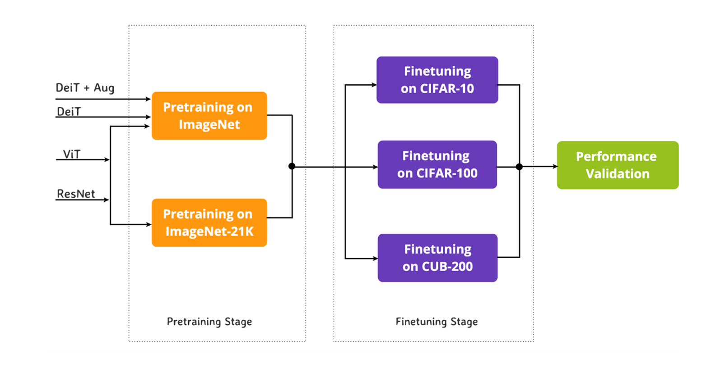
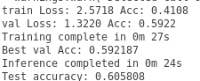

# Finetuning and Evaluating Vision Transformers and ResNets for Image Classification

### Validating image classification benchmark results on ViTs, DeiT and ResNets BiT models
---


Hello everyone!
This repository contains the code implementation for our ML701 project "Transformers Transforming Vision", in which we have revisted the baseline vision transformers such as ViTs, DeiT and compared them with the CNN models like ResNet BiT.

We have tried to validate the official published results of ViTs, DeiTs and ResNets on CIFAR-10 and CIFAR-100, when they are pretrained on different datasets like ImageNet and ImageNet-21k. Additionally, we have used CUB200 dataset and exploited the importance of having high resolution images specifically for vision transformers. Our approch is summarized below:
<p align="center">
  
</p>

Specifically, we provide finetuning and evalutation scripts for all ResNet-BiT, ViT and DeiT models which are supported by PyTorch library.


-----------

Requirements
---
To run the scripts, following packages needs to be installed (preferably on Ubuntu 18.04 LTS / 20.04 LTS):
<ul>
  <li>
    Python (version 3.6 or greater)
  </li>
    <li>
    Pytorch (version 1.10) and Torchvision (version 0.3.0)
  </li>
    <li>
    Pytorch timm library (preferably version 0.4.12)
    </li>
  </ul>
  
  
 To install these, use pip package installer to install those one by one, or you can anaconda environment (highly recommended) using the provided env.yml file.
 
 TO set-up environment using the anaconda environment please follow and execute the following commands in terminal:
 
 1. Create new conda environment using the env.yml file (provided in repository).
  ```bash
 $ conda env create --file env.yml
```
 2. Now all required packages are installed in this environment, it can now be activated as follows:.
  ```bash
$ conda activate visiontimm
```
------------

## Command Line Parameters
The below table lists the command line parameters available for `main.py` which is used for both evaluation as well as finetuning of models.

### `main.py`

| Parameter | Description  | Possible Values |
| ------------- | ------------- | ------------- |
| --batch-size | batch size of dataloader | int: any integer value, e.g. 16, 24, etc. |
| --num-epochs | number of training epochs. | int: (any integer value) |
| --model-name  | name of model to evaluate/finetune | string: ViTs, DeiTs and ResNets models supported in timm, eg: 'deit_base_patch16_224' |
| --img-size    | resolution of input images | int: eg: 224 |
| --optimizer   | optimizer for training | string: possible values are 'ADAM' and 'SGD' |
| --lr          | learning rate during finetuning | float: any float value, e.g 0.01 |
| --training    | finetune from checkpoint | boolean: (default: True), put False for evaluation |
| --weights-path | path where you want to save model weights after training. | string: (default: './saved_models') |
| --load-weights | path from where trained weights are to be loaded (only required for evaluating a pretrained model. | string: path of the model weights eg. path/to/my/model/weights |
| --figure-path | path for saving plots. | string: (default: './figures') |
| --data-path' | path where dataset is present. | string: (default: './data') |
| --dataset-name  | Choice of dataset | string: can choose from 'CIFAR10', 'CIFAR100', 'CUB200'|
| --val-pct  | validation split from the training set. | float: (default: 0.1) |


<b> NOTE: To use CUB200 dataset in the experiments, please manually download the <a href="https://drive.google.com/file/d/1hbzc_P1FuxMkcabkgn9ZKinBwW683j45/view">CUB_200_2011.tgz</a> file and paste it into the './data' directory. </b>

Finetuning models
---
To finetune a timm model, we can run the main.py as follows:
  ```bash
 $ python main.py --model-name 'timm model name' --dataset-name 'dataset name' --num-epochs 'epochs you want'
```

### Sample input and output for finetuning:

To finetune a DeiT-Base model (deit_base_patch16_224) on CUB200 dataset for 1 epoch (with other parameters as default), we can execute as follows:

  ```bash
$ python main.py --model-name deit_base_patch16_224 --dataset-name CUB200 --num-epochs 1
```
Its expected output is shown below:

<p align="center">
  
</p>


------------


Evaluating models
---
To evalute a model already finetuned on, we can run the main.py as follows:

 ```bash
 $ python main.py --training False --model-name 'timm model name' --dataset-name 'dataset name' --load-weights ./saved_model_weights_name
```

### Sample input and output for evaluation:

To evaluate a finetuned/trained DeiT-Base model (deit_base_patch16_224) on CUB200 dataset with its given weights file, we can execute as follows:

  ```bash
$ python main.py --training False --model-name deit_base_patch16_224 --dataset-name CUB200 --load-weights ./saved_models/deit_224
```
Its expected output is shown below:

<p align="center">
  
</p>


------------
